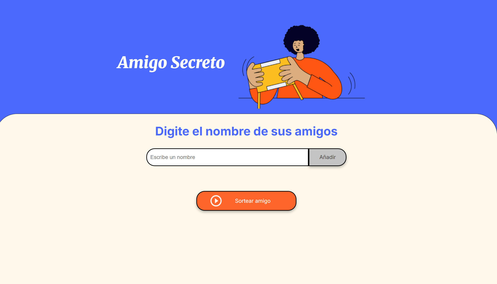

# Amigo Secreto - Challenge Alura

## Descripción

El siguiente proyecto consiste en desarrollar una aplicación que permite almacenar una lista de nombres y elegir uno de manera aleatoria, el cual será llamado como "Amigo Secreto".

## Funcionalidades

- **Agregar nombres**: Escribir el nombre en el campo de texto y darle click al botón "Añadir" para que se puede almacenar los nombres que desees que jueguen al Amigo Secreto. Tener en cuenta que el campo no debe estar vacío.

- **Lista de jugadores**: Al añadir los nombres que el usuario eligió, estos se mostrarás en la parte inferior del campo de texto en forma de lista para observar los participantes.

- **Sortear amigo secreto**: Al darle click en el botón "Sortear amigo", automáticamente se elegirá uno al azar y mostrará un mensaje con el nombre elegido. Ejemplo: "El amigo secreto es Jhesly".

- **Deshabilitación**: Luego de elegir el Amigo Secreto, los botones de deshabilitarán y cambiarán de color. Para jugar nuevamente, actualizar la página.

## ¿Cómo se usa la aplicación?

1. **Agrega jugadores**: Insertar el nombre de las personas que van a jugar en el campo de texto y darle click al botón "Añadir" para cada participante.
2. **Iniciar sorteo**: Luego de haber finalizado con la inclusión de participantes, darle click al botón "Sortear amigo". Se mostrará un mensaje con el nombre del Amigo Secreto.

## Requisitos para usar la aplicación

- Un dispositivo con conexión a Internet
